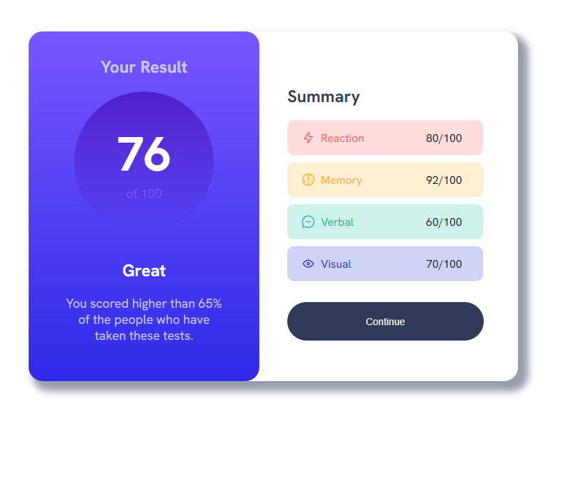

# Frontend Mentor - Results summary component solution

This is a solution to the [Results summary component challenge on Frontend Mentor](https://www.frontendmentor.io/challenges/results-summary-component-CE_K6s0maV). Frontend Mentor challenges help you improve your coding skills by building realistic projects. 

## Table of contents

- [Frontend Mentor - Results summary component solution](#frontend-mentor---results-summary-component-solution)
  - [Table of contents](#table-of-contents)
  - [Overview](#overview)
    - [The challenge](#the-challenge)
    - [Screenshot](#screenshot)
    - [Links](#links)
  - [My process](#my-process)
    - [Built with](#built-with)
    - [What I learned](#what-i-learned)
    - [Continued development](#continued-development)
    - [Useful resources](#useful-resources)
  - [Author](#author)

## Overview  

### The challenge

Users should be able to:

- View the optimal layout for the interface depending on their device's screen size
- See hover and focus states for all interactive elements on the page
- **Bonus**: Use the local JSON data to dynamically populate the content

### Screenshot

### Links

- Solution URL: [Add solution URL here](https://github.com/chisouche/results-summary-component-main)
- Live Site URL: [Add live site URL here](https://result-summary-challenge-two.vercel.app/)

## My process

For this project, I followed a structured approach to ensure efficiency and a successful outcome. The steps I took include:

- Project Brief Analysis: I started by thoroughly analyzing the project brief, understanding the requirements, and identifying key deliverables.

- Planning: I created a project plan outlining the tasks, timelines, and milestones to keep the project on track.

- Design and Wireframing: I worked on the design phase, creating wireframes and sketches to visualize the project's layout and structure.

- Development: I implemented the design using HTML and CSS, ensuring responsiveness for different screen sizes.

- Testing: I rigorously tested the project on various browsers and devices to identify and fix any compatibility issues.

- Optimization: I focused on optimizing the project for performance, ensuring fast loading times and efficient code.

- Documentation: I created this project documentation to provide insights into the project's development process, tools used, and key decisions made.

### Built with

- Semantic HTML5 markup: I used HTML5 for structuring the project's content.
- CSS custom properties: CSS3 was utilized for styling and Sass 
- (SCSS): I employed Sass, a powerful CSS preprocessor, to enhance the maintainability and organization of my styles. This allowed me to use features like variables, nesting, and mixins for more efficient styling.
- Flexbox:  I used Flexbox for flexible and responsive layout design
- CSS Grid: CSS Grid was implemented for grid-based layout structures.

### What I learned

In completing the Frontend Mentor QR code component challenge, I learned valuable skills including HTML, CSS, responsive design, image handling, flexbox, positioning, problem-solving, version control, code organization, best practices, attention to detail, self-learning, and design skills. This project provided hands-on experience.

### Continued development

In my journey as a frontend developer, I recognize the need for continued development in refining my CSS skills to create more intricate and visually appealing designs. I also aim to enhance my proficiency in JavaScript to add interactivity and functionality to my projects. Additionally, I'll continue exploring responsive web design to ensure seamless user experiences across various devices. These skills will not only elevate my career prospects but also allow me to take on more complex and challenging projects, solidifying my position as a well-rounded and adaptable developer.

### Useful resources

- [3 CSS techniques for border only in corners](https://codepen.io/ThiemelJiri/post/3-css-border-in-corners-techniques) - This helped me forcreating border corners. It was the easiest explanation i found
- [HSL Colors](https://www.w3schools.com/css/css_colors_hsl.asp) - This is amazing it helped me  understand HSL format, opacity and so on. I'd recommend it to anyone still learning this concept.
  
  
## Author

- Frontend Mentor - [@chisouche](https://www.frontendmentor.io/profile/chisouche)
- Twitter - [@spacerjace](https://twitter.com/spacerjacee)

